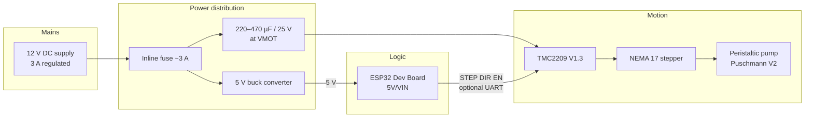
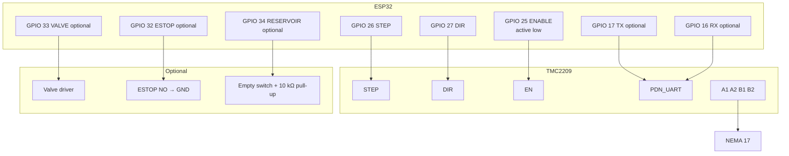

# Wiring

Default pin map for the ELEGOO ESP32 Dev Board (`esp32dev`) and a BIGTREETECH
TMC2209 V1.3 StepStick. Override pins in `platformio.ini` if your board differs.

**Related:** [HARDWARE.md](HARDWARE.md) · [BOM.md](BOM.md)

## Safety before you power on

1. Verify the buck converter outputs **5.0 V ±0.1 V** before connecting ESP32
   `5V`/`VIN`.
2. Tie all grounds together (12 V supply, buck, TMC2209, ESP32).
3. Do **not** feed 12 V into the ESP32 `5V`/`VIN` pin.
4. Do **not** drive a piezoelectric valve from an ESP32 GPIO; use a matched
   valve driver.
5. Fit the motor supply capacitor close to TMC2209 `VMOT` and `GND`.
6. Use an inline ~3 A fuse on the 12 V input for permanent builds.

## System overview

## Required connections

### Power

| From | To | Notes |
|------|-----|-------|
| 12 V adapter + | Fuse input | Center-positive barrel jack typical |
| Fuse output | Buck `VIN+`, TMC `VMOT`, capacitor + | Common 12 V rail |
| 12 V adapter − | Buck `VIN−`/`GND`, TMC `GND`, capacitor −, ESP32 `GND` | Common ground |
| Buck `VOUT+` (5 V) | ESP32 `5V` or `VIN` | Confirm 5 V before connecting |
| Buck `VOUT−` | ESP32 `GND` | Same ground as above |
| ESP32 `3V3` | TMC `VIO` | Logic reference for STEP/DIR/EN/UART (3.3 V) |

Capacitor polarity matters: positive to `VMOT`, negative to `GND`, leads as short
as practical.

### Stepper driver control (required)

| ESP32 GPIO | TMC2209 signal | Notes |
|------------|----------------|-------|
| **26** | `STEP` | Step pulses |
| **27** | `DIR` | Direction |
| **25** | `EN` / `ENABLE` | **Active low** — HIGH at boot = driver disabled |
| `GND` | `GND` | Must share ground with motor supply |

Leave TMC `MS1`/`MS2` as needed for UART address `0b00` (both low on BTT V1.3
defaults) when using UART later.

### Motor phases

| TMC2209 | NEMA 17 (typical 4-wire) |
|---------|--------------------------|
| `A1` / `A2` | Coil A (one pair) |
| `B1` / `B2` | Coil B (other pair) |

Identify coil pairs with a multimeter (continuity within a pair). STEPPERONLINE
leads are often black/green and red/blue, but **verify against your motor
datasheet**. If the pump runs the wrong way, invert direction in the UI or swap
one coil pair at the driver.

The motor mounts to the printed pump housing with M3×16 mm screws; mechanical
assembly follows [Puschmann’s documentation](HARDWARE.md).

## Control signal diagram

## Optional connections

### TMC2209 UART

| ESP32 | TMC2209 | Notes |
|-------|---------|-------|
| GPIO **17** (`TX`) | `PDN_UART` | Configure current / microsteps / StealthChop |
| GPIO **16** (`RX`) | UART return / PDN sense per silkscreen | Single-wire UART path on many StepSticks |

Enable motor-driver UART in Configuration after wiring. Motion still uses STEP/DIR;
UART only configures the driver. See [HARDWARE.md](HARDWARE.md).

### Valve (anti-drip / cutoff)

| ESP32 | Device | Notes |
|-------|--------|-------|
| GPIO **33** | Valve **driver** enable/input | Active-high in firmware by default |
| Valve driver power | Per valve datasheet | Often not 3.3 V logic-level coil drive |
| Valve ports | Fluid line after pump | Chemically compatible, normally closed preferred |

Mark the matching pump as having a shutoff valve in Configuration before use.

### Emergency stop

| ESP32 | Switch |
|-------|--------|
| GPIO **32** | One side of NO ESTOP |
| `GND` | Other side of NO ESTOP |

Active-low with internal pull-up. Enable in Configuration before relying on it.

### Reservoir empty sense

| Connection | Notes |
|------------|-------|
| GPIO **34** | Input-only; **no** internal pull-up |
| 10 kΩ to `3V3` | External pull-up |
| NO float/optical switch to `GND` | Asserts empty when closed (default active-low) |

### Stepper driver control — pump 2 / pump 3 (optional)

Set **Number of installed pumps = 2 or 3** in Configuration. Strap each extra TMC2209 UART
address via MS1/MS2 (`0b01` for pump 2, `0b10` for pump 3).

| ESP32 GPIO | Signal | Notes |
|------------|--------|-------|
| **5** | Pump 2 `STEP` | |
| **13** | Pump 2 `DIR` | |
| **14** | Pump 2 `EN` | Active low |
| **21** | Pump 2 valve driver (optional) | Driver only — not piezo coils |
| **22** | Pump 3 `STEP` | |
| **15** | Pump 3 `DIR` | Strapping pin — quiet at boot |
| **2** | Pump 3 `EN` | Active low |
| **12** | Pump 3 valve driver (optional) | Strapping pin — quiet at boot |
| 16 / 17 | Shared UART RX/TX | Addresses `0b00` / `0b01` / `0b10` |

## Pin summary

| Function | GPIO | Required | Polarity / notes |
|----------|------|----------|------------------|
| Pump 1 STEP | 26 | Yes | Pulse to TMC #1 |
| Pump 1 DIR | 27 | Yes | Level to TMC #1 |
| Pump 1 ENABLE | 25 | Yes | Active low |
| Pump 1 VALVE | 33 | No | To valve driver only |
| Pump 2 STEP | 5 | No | Configuration pump count ≥ 2 |
| Pump 2 DIR | 13 | No | |
| Pump 2 ENABLE | 14 | No | Active low |
| Pump 2 VALVE | 21 | No | To valve driver only |
| Pump 3 STEP | 22 | No | Configuration pump count ≥ 3 |
| Pump 3 DIR | 15 | No | Strapping |
| Pump 3 ENABLE | 2 | No | Active low |
| Pump 3 VALVE | 12 | No | Strapping; valve driver only |
| ESTOP | 32 | No | Active low to GND |
| TMC RX | 16 | No | UART (shared, up to 4 addresses) |
| TMC TX | 17 | No | UART |
| RESERVOIR | 34 | No | External pull-up required |
| HX711 DT | 19 | No | |
| HX711 SCK | 18 | No | |
| TEMP | 23 | No | DS18B20 1-Wire |
| FLOW | 4 | No | Pulse input |

**Motion limit:** firmware runs **one path at a time** (no concurrent STEP). Size
the 12 V supply for a single 1.5 A/phase motor unless you validate multi-load.

## Common mistakes

| Mistake | Result |
|---------|--------|
| No common ground | Erratic STEP/DIR, UART failures |
| 12 V into ESP32 `VIN` | Damaged board |
| Cap far from `VMOT` | Driver resets / noise under load |
| Piezo valve on GPIO 33 | Damaged ESP32 / non-functional valve |
| ENABLE assumed active-high | Motor always on or never enables |
| Forgetting `upload` vs USB-only power | Weak 5 V from USB while motor draws from 12 V — use the buck for sustained runs |

## Plumbing (not electrical)

Fluid contacts **tubing only** inside the peristaltic pump. Keep reservoirs,
tubing, and any valve physically separated from the ESP32, driver, and buck
converter. Dedicate tubing per fluid when cross-contamination matters.
